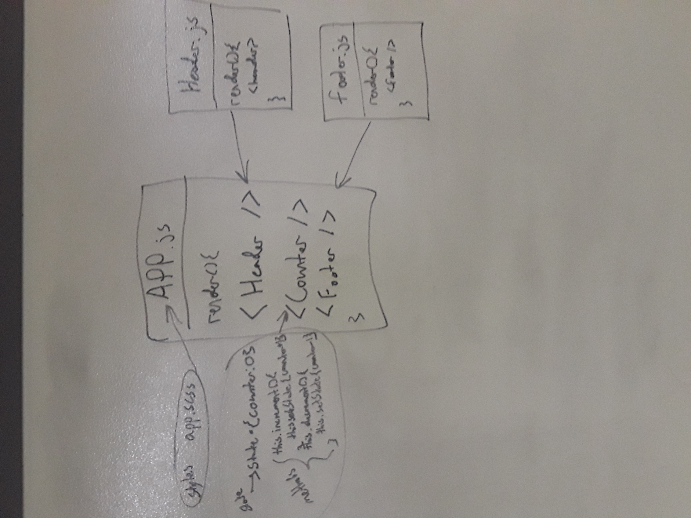

# Lab26 - Component Based UI
Uses React to display an App component with a header, footer, and counter
### Author: Chris Kozlowski

### Links and Resources
* [Submission PR](https://github.com/401-advanced-javascript-cdk/lab-26-component-based-ui/pull/1)

### Modules
#### `index.js`
Gets the root element in the HTML and renders the App component
#### `app.js`
Imports the Header and Footer components.  Contains the Counter component with a count integer in state and methods for increasing and decresing the count.  The Counter component has links that trigger the methods when clicked.  The App component renders all three components.
#### `components/header.js`
Dummy component that renders the header.
#### `component/footer.js`
Dummy component that renders the footer.
#### `app.scss`
Defines the styling for the app.

#### Operation
The app can be viewed by installing npm packages and running `npm run start`.  If it doesn't automatically open in the browser it can be accessed at http://localhost:3000

#### UML
